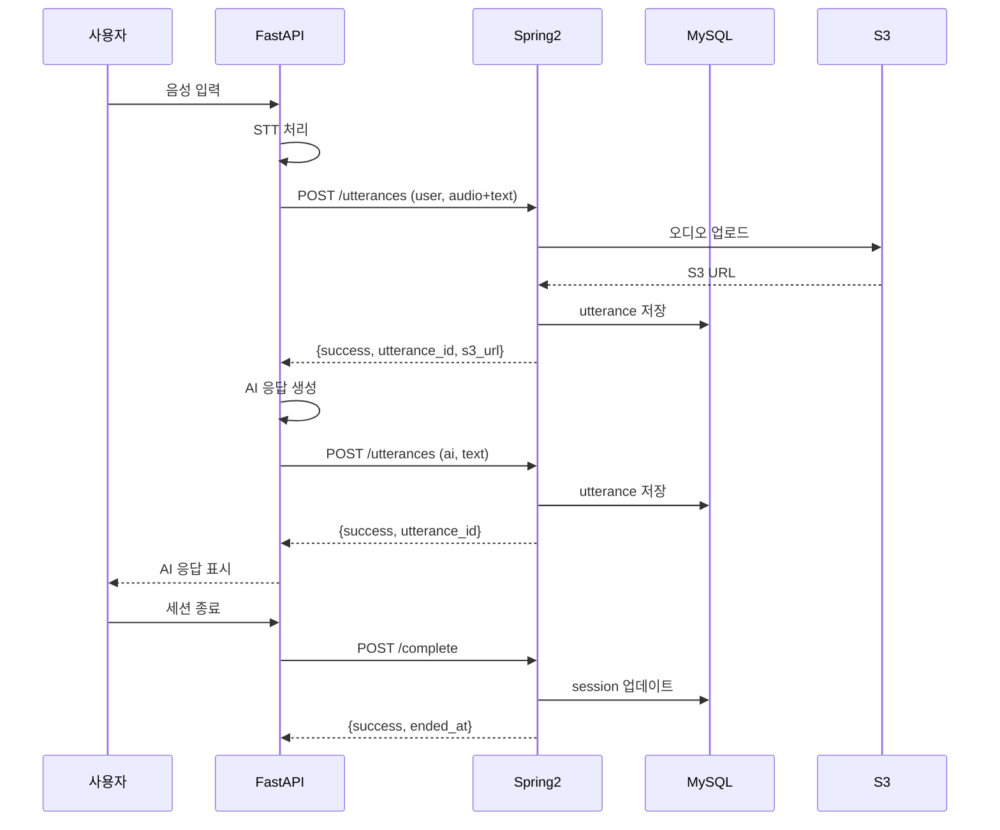

# Spring 2 롤플레잉 대화 저장 API 구현 가이드

## 📋 개요

FastAPI 롤플레잉 서버에서 **실시간으로** 발화 데이터를 받아 MySQL에 저장하는 API를 구현합니다.

### 핵심 요구사항
- ✅ **실시간 저장**: 각 발화가 발생할 때마다 즉시 DB 저장
- ✅ **피드백 준비**: 세션 종료 후 바로 대화 내용 조회 가능
- ✅ **화자 구분**: 사용자(user)와 AI(ai) 발화 구분 저장
- ✅ **오디오 지원**: 텍스트만 또는 오디오+텍스트 모두 지원

---

## 🗄️ 데이터베이스 스키마

### 1. sessions 테이블 (세션 관리)

```sql
CREATE TABLE IF NOT EXISTS sessions (
    session_id VARCHAR(36) PRIMARY KEY,  -- UUID from Spring 1
    user_id BIGINT NOT NULL,
    scenario_id INT NOT NULL,
    status ENUM('ACTIVE', 'FINISHED', 'ERROR') DEFAULT 'ACTIVE',
    started_at TIMESTAMP DEFAULT CURRENT_TIMESTAMP,
    ended_at TIMESTAMP NULL,
    end_reason VARCHAR(50) NULL,  -- 'user_end', 'timeout', 'disconnected', 'error'

    INDEX idx_user_id (user_id),
    INDEX idx_scenario_id (scenario_id),
    INDEX idx_status (status),
    INDEX idx_started_at (started_at)
);
```

**주요 필드 설명:**
- `session_id`: Spring 1이 발급한 UUID (VARCHAR(36), PRIMARY KEY)
- `user_id`: 사용자 ID
- `scenario_id`: 시나리오 ID
- `status`: 세션 상태 (ACTIVE, FINISHED, ERROR)
- `end_reason`: 종료 사유 (user_end, timeout, disconnected, error)

### 2. utterances 테이블 (발화 저장)

```sql
CREATE TABLE utterances (
    id BIGINT AUTO_INCREMENT PRIMARY KEY,
    session_id VARCHAR(36) NOT NULL,  -- UUID (sessions 테이블 참조)
    utterance_index INT NOT NULL,
    speaker ENUM('user', 'ai') NOT NULL,  -- 화자 구분
    text TEXT NOT NULL,                   -- 발화 텍스트 (STT 결과 또는 AI 응답)
    s3_url VARCHAR(512),                  -- 오디오 S3 URL (사용자 발화만, 선택사항)
    started_at TIMESTAMP,                 -- 발화 시작 시각 (사용자 발화만)
    ended_at TIMESTAMP,                   -- 발화 종료 시각 (사용자 발화만)
    created_at TIMESTAMP DEFAULT CURRENT_TIMESTAMP,

    FOREIGN KEY (session_id) REFERENCES sessions(session_id) ON DELETE CASCADE,
    INDEX idx_session_id (session_id),
    INDEX idx_session_speaker (session_id, speaker),
    INDEX idx_created_at (created_at),
    UNIQUE KEY uk_session_utterance (session_id, utterance_index)
);
```

**주요 필드 설명:**
- `session_id`: UUID (VARCHAR(36), sessions 테이블 참조)
- `speaker`: `'user'` (사용자) 또는 `'ai'` (AI 튜터)
- `utterance_index`: 세션 내 발화 순서 (0부터 시작)
- `s3_url`: 사용자 음성 녹음 파일 경로 (AI 응답은 NULL)
- `started_at`, `ended_at`: 사용자 발화에만 사용 (AI는 NULL)

---

## 🎯 API 엔드포인트

### 🔑 중요: session_id 흐름

```
Spring 1 (UUID 생성) → Spring 2 (UUID 저장) → FastAPI (UUID 사용)
```

- **Spring 1**: UUID session_id 생성 및 Spring 2에 전달
- **Spring 2**: UUID를 그대로 받아 MySQL에 저장 (VARCHAR(36))
- **FastAPI**: UUID로 Spring 2 API 호출 (변환 없음)

---

### API 0: 세션 생성 ⭐ **NEW**

**엔드포인트:** `POST /internal/sessions`

**호출 시점:** Spring 1이 세션 생성 요청 시

**용도:** MySQL에 세션 생성 (UUID 그대로 저장)

#### 요청

```http
POST /internal/sessions
Content-Type: application/json

{
  "session_id": "abc-123-def-456",
  "user_id": 1,
  "scenario_id": 31
}
```

#### 응답

**성공 (201 Created):**
```json
{
  "success": true
}
```

**실패 (400):**
```json
{
  "success": false,
  "error": "Invalid user_id or scenario_id"
}
```

**구현 예시:**

```java
@PostMapping
public ResponseEntity<SessionCreateResponse> createSession(
        @Valid @RequestBody SessionCreateRequest request
) {
    log.info("Create session: session_id={}, user={}, scenario={}",
        request.getSessionId(), request.getUserId(), request.getScenarioId());

    // 시나리오 검증
    Scenario scenario = scenarioRepository.findByIdAndUserId(
        request.getScenarioId(),
        request.getUserId()
    );

    if (scenario == null) {
        return ResponseEntity.badRequest()
            .body(SessionCreateResponse.builder()
                .success(false)
                .error("Invalid user_id or scenario_id")
                .build());
    }

    // 세션 저장 (UUID 그대로)
    Session session = Session.builder()
        .sessionId(request.getSessionId())  // UUID
        .userId(request.getUserId())
        .scenarioId(request.getScenarioId())
        .status(Session.Status.ACTIVE)
        .startedAt(LocalDateTime.now())
        .build();

    sessionRepository.save(session);

    return ResponseEntity.status(HttpStatus.CREATED)
        .body(SessionCreateResponse.builder()
            .success(true)
            .build());
}
```

---

### API 1: 발화 저장 (실시간)

**엔드포인트:** `POST /internal/sessions/{sessionId}/utterances`

**호출 주기:** 각 발화마다 즉시 호출 (실시간 저장)

#### 요청 A: 사용자 텍스트만 (JSON)

```http
POST /internal/sessions/abc-123-def/utterances
Content-Type: application/json

{
  "speaker": "user",
  "text": "I am working on the authentication refactoring.",
  "utterance_index": 0,
  "started_at": "2025-11-18T10:00:00Z",
  "ended_at": "2025-11-18T10:00:05Z"
}
```

#### 요청 B: 사용자 오디오 + 텍스트 (multipart/form-data)

```http
POST /internal/sessions/abc-123-def/utterances
Content-Type: multipart/form-data

fields:
  - audio: (binary file, audio/wav)
  - speaker: "user"
  - text: "I am working on the authentication refactoring."
  - utterance_index: "0"
  - started_at: "2025-11-18T10:00:00Z"
  - ended_at: "2025-11-18T10:00:05Z"
```

#### 요청 C: AI 응답 (JSON)

```http
POST /internal/sessions/abc-123-def/utterances
Content-Type: application/json

{
  "speaker": "ai",
  "text": "That sounds great! What challenges are you facing with the refactoring?",
  "utterance_index": 1
}
```

**참고:** AI 응답은 오디오 없이 텍스트만 저장, `started_at`/`ended_at` 불필요

#### 응답

**성공 (200):**
```json
{
  "success": true,
  "utterance_id": 123,
  "s3_url": "s3://skala-bucket/sessions/abc-123-def/utterance_0.wav"  // 오디오 있을 경우만
}
```

**실패 (404):**
```json
{
  "success": false,
  "error": "Session not found"
}
```

---

### API 2: 세션 완료

**엔드포인트:** `POST /internal/sessions/{sessionId}/complete`

**호출 시점:** 사용자가 세션 종료 또는 WebSocket 연결 끊김

```http
POST /internal/sessions/abc-123-def/complete
Content-Type: application/json

{
  "status": "FINISHED",
  "reason": "user_end"
}
```

**status 값:**
- `"FINISHED"`: 정상 종료
- `"ERROR"`: 오류로 인한 종료

**reason 값:**
- `"user_end"`: 사용자가 /quit 명령 또는 종료 버튼
- `"timeout"`: 타임아웃
- `"disconnected"`: WebSocket 연결 끊김
- `"error"`: 서버 오류

#### 응답

```json
{
  "success": true,
  "session_id": "abc-123-def",
  "ended_at": "2025-11-18T10:15:30Z",
  "total_utterances": 20
}
```

---

### API 3: 대화 내용 조회 (피드백용)

**엔드포인트:** `GET /internal/sessions/{sessionId}/utterances`

**용도:** 세션 종료 후 피드백 작성을 위해 전체 대화 내용 조회

```http
GET /internal/sessions/abc-123-def/utterances
```

#### 응답

```json
{
  "session_id": "abc-123-def",
  "status": "FINISHED",
  "utterances": [
    {
      "id": 1,
      "utterance_index": 0,
      "speaker": "ai",
      "text": "How are you progressing with the API development?",
      "created_at": "2025-11-18T10:00:00Z"
    },
    {
      "id": 2,
      "utterance_index": 1,
      "speaker": "user",
      "text": "I am working on the authentication refactoring.",
      "s3_url": "s3://skala-bucket/sessions/abc-123-def/utterance_1.wav",
      "started_at": "2025-11-18T10:00:05Z",
      "ended_at": "2025-11-18T10:00:10Z",
      "created_at": "2025-11-18T10:00:10Z"
    },
    {
      "id": 3,
      "utterance_index": 2,
      "speaker": "ai",
      "text": "That sounds great! What challenges are you facing?",
      "created_at": "2025-11-18T10:00:12Z"
    }
  ]
}
```

---

## 📝 Java 구현 예시

### 1. Entity (JPA)

```java
@Entity
@Table(name = "sessions")
@Data
@Builder
@NoArgsConstructor
@AllArgsConstructor
public class Session {

    @Id
    @Column(name = "session_id", length = 36)
    private String sessionId;  // UUID from Spring 1

    @Column(name = "user_id", nullable = false)
    private Long userId;

    @Column(name = "scenario_id", nullable = false)
    private Integer scenarioId;

    @Enumerated(EnumType.STRING)
    @Column(name = "status")
    private Status status;

    @Column(name = "started_at")
    private LocalDateTime startedAt;

    @Column(name = "ended_at")
    private LocalDateTime endedAt;

    @Column(name = "end_reason", length = 50)
    private String endReason;

    public enum Status {
        ACTIVE, FINISHED, ERROR
    }
}

@Entity
@Table(name = "utterances")
@Data
@Builder
@NoArgsConstructor
@AllArgsConstructor
public class Utterance {

    @Id
    @GeneratedValue(strategy = GenerationType.IDENTITY)
    private Long id;

    @Column(name = "session_id", nullable = false, length = 36)
    private String sessionId;  // UUID

    @Column(name = "utterance_index", nullable = false)
    private Integer utteranceIndex;

    @Enumerated(EnumType.STRING)
    @Column(name = "speaker", nullable = false)
    private Speaker speaker;  // USER, AI

    @Column(name = "text", nullable = false, columnDefinition = "TEXT")
    private String text;

    @Column(name = "s3_url", length = 512)
    private String s3Url;

    @Column(name = "started_at")
    private LocalDateTime startedAt;

    @Column(name = "ended_at")
    private LocalDateTime endedAt;

    @Column(name = "created_at")
    private LocalDateTime createdAt;

    public enum Speaker {
        USER, AI
    }
}
```

### 2. DTO

```java
@Data
public class UtteranceCreateRequest {

    @NotBlank
    private String speaker;  // "user" or "ai"

    @NotBlank
    private String text;

    @NotNull
    private Integer utteranceIndex;

    // 사용자 발화만 필수 (AI는 null)
    private LocalDateTime startedAt;
    private LocalDateTime endedAt;

    public Utterance.Speaker getSpeakerEnum() {
        return "user".equalsIgnoreCase(speaker)
            ? Utterance.Speaker.USER
            : Utterance.Speaker.AI;
    }
}

@Data
@Builder
public class UtteranceCreateResponse {
    private Boolean success;
    private Long utteranceId;
    private String s3Url;
}

@Data
public class SessionCompleteRequest {
    @NotBlank
    private String status;  // "FINISHED" or "ERROR"

    @NotBlank
    private String reason;  // "user_end", "timeout", etc.
}

@Data
@Builder
public class SessionCompleteResponse {
    private Boolean success;
    private String sessionId;
    private LocalDateTime endedAt;
    private Integer totalUtterances;
}
```

### 3. Controller

```java
@RestController
@RequestMapping("/internal/sessions")
@Slf4j
public class RoleplayingInternalController {

    @Autowired
    private UtteranceService utteranceService;

    @Autowired
    private SessionService sessionService;

    /**
     * 발화 저장 API (실시간)
     * - JSON: 텍스트만 (사용자 텍스트 또는 AI 응답)
     * - multipart/form-data: 오디오 + 텍스트 (사용자 음성)
     */
    @PostMapping("/{sessionId}/utterances")
    public ResponseEntity<UtteranceCreateResponse> saveUtterance(
            @PathVariable Long sessionId,  // 숫자 ID
            @RequestPart(required = false) MultipartFile audio,
            @Valid @ModelAttribute UtteranceCreateRequest request
    ) {
        log.info("Save utterance: session={}, speaker={}, index={}, hasAudio={}",
            sessionId, request.getSpeaker(), request.getUtteranceIndex(), audio != null);

        UtteranceCreateResponse response = utteranceService.saveUtterance(
            sessionId,
            audio,
            request
        );

        return ResponseEntity.ok(response);
    }

    /**
     * 세션 완료 API
     */
    @PostMapping("/{sessionId}/complete")
    public ResponseEntity<SessionCompleteResponse> completeSession(
            @PathVariable Long sessionId,  // 숫자 ID
            @Valid @RequestBody SessionCompleteRequest request
    ) {
        log.info("Complete session: session={}, status={}, reason={}",
            sessionId, request.getStatus(), request.getReason());

        SessionCompleteResponse response = sessionService.completeSession(
            sessionId,
            request
        );

        return ResponseEntity.ok(response);
    }

    /**
     * 대화 내용 조회 API (피드백용)
     */
    @GetMapping("/{sessionId}/utterances")
    public ResponseEntity<SessionUtterancesResponse> getUtterances(
            @PathVariable Long sessionId  // 숫자 ID
    ) {
        log.info("Get utterances: session={}", sessionId);

        SessionUtterancesResponse response = utteranceService.getUtterances(sessionId);

        return ResponseEntity.ok(response);
    }
}
```

### 4. Service

```java
@Service
@Slf4j
public class UtteranceService {

    @Autowired
    private UtteranceRepository utteranceRepository;

    @Autowired
    private S3Service s3Service;

    @Autowired
    private SessionRepository sessionRepository;

    @Transactional
    public UtteranceCreateResponse saveUtterance(
            Long sessionId,  // 숫자 ID로 변경
            MultipartFile audio,
            UtteranceCreateRequest request
    ) {
        // 1. 세션 존재 확인
        Session session = sessionRepository.findById(sessionId)
            .orElseThrow(() -> new SessionNotFoundException(sessionId));

        // 2. S3 업로드 (사용자 오디오가 있을 경우만)
        String s3Url = null;
        if (audio != null && !audio.isEmpty()) {
            if (!"user".equalsIgnoreCase(request.getSpeaker())) {
                throw new IllegalArgumentException("Audio is only allowed for user speaker");
            }

            String s3Key = String.format(
                "sessions/%s/utterance_%d.wav",
                sessionId,
                request.getUtteranceIndex()
            );

            try {
                s3Url = s3Service.uploadFile(s3Key, audio);
                log.info("Audio uploaded: s3Url={}, size={}", s3Url, audio.getSize());
            } catch (Exception e) {
                log.error("S3 upload failed: {}", e.getMessage(), e);
                throw new S3UploadException("Failed to upload audio", e);
            }
        }

        // 3. DB 저장
        Utterance utterance = Utterance.builder()
            .sessionId(sessionId)
            .utteranceIndex(request.getUtteranceIndex())
            .speaker(request.getSpeakerEnum())
            .text(request.getText())
            .s3Url(s3Url)
            .startedAt(request.getStartedAt())
            .endedAt(request.getEndedAt())
            .createdAt(LocalDateTime.now())
            .build();

        utterance = utteranceRepository.save(utterance);

        log.info("Utterance saved: id={}, speaker={}, index={}",
            utterance.getId(), utterance.getSpeaker(), utterance.getUtteranceIndex());

        // 4. 응답 반환
        return UtteranceCreateResponse.builder()
            .success(true)
            .utteranceId(utterance.getId())
            .s3Url(s3Url)
            .build();
    }

    @Transactional(readOnly = true)
    public SessionUtterancesResponse getUtterances(Long sessionId) {  // Long으로 변경
        // 세션 확인
        Session session = sessionRepository.findById(sessionId)
            .orElseThrow(() -> new SessionNotFoundException(sessionId));

        // 발화 목록 조회 (utterance_index 순서대로)
        List<Utterance> utterances = utteranceRepository
            .findBySessionIdOrderByUtteranceIndexAsc(sessionId);

        List<UtteranceDto> utteranceDtos = utterances.stream()
            .map(this::toDto)
            .collect(Collectors.toList());

        return SessionUtterancesResponse.builder()
            .sessionId(String.valueOf(sessionId))  // Long → String 변환 (응답용)
            .status(session.getStatus().name())
            .utterances(utteranceDtos)
            .build();
    }

    private UtteranceDto toDto(Utterance utterance) {
        return UtteranceDto.builder()
            .id(utterance.getId())
            .utteranceIndex(utterance.getUtteranceIndex())
            .speaker(utterance.getSpeaker().name().toLowerCase())
            .text(utterance.getText())
            .s3Url(utterance.getS3Url())
            .startedAt(utterance.getStartedAt())
            .endedAt(utterance.getEndedAt())
            .createdAt(utterance.getCreatedAt())
            .build();
    }
}
```

```java
@Service
@Slf4j
public class SessionService {

    @Autowired
    private SessionRepository sessionRepository;

    @Autowired
    private UtteranceRepository utteranceRepository;

    @Transactional
    public SessionCompleteResponse completeSession(
            Long sessionId,  // Long으로 변경
            SessionCompleteRequest request
    ) {
        // 1. 세션 조회
        Session session = sessionRepository.findById(sessionId)
            .orElseThrow(() -> new SessionNotFoundException(sessionId));

        // 2. 세션 상태 업데이트
        LocalDateTime endedAt = LocalDateTime.now();
        session.setStatus(Session.Status.valueOf(request.getStatus()));
        session.setEndedAt(endedAt);
        session.setEndReason(request.getReason());

        sessionRepository.save(session);

        // 3. 발화 수 조회
        Integer totalUtterances = utteranceRepository.countBySessionId(sessionId);

        log.info("Session completed: session={}, status={}, reason={}, utterances={}",
            sessionId, request.getStatus(), request.getReason(), totalUtterances);

        return SessionCompleteResponse.builder()
            .success(true)
            .sessionId(String.valueOf(sessionId))  // Long → String 변환 (응답용)
            .endedAt(endedAt)
            .totalUtterances(totalUtterances)
            .build();
    }
}
```

### 5. Repository

```java
@Repository
public interface SessionRepository extends JpaRepository<Session, Long> {
    // 기본 CRUD는 JpaRepository가 제공
}

@Repository
public interface UtteranceRepository extends JpaRepository<Utterance, Long> {

    List<Utterance> findBySessionIdOrderByUtteranceIndexAsc(Long sessionId);  // Long으로 변경

    Integer countBySessionId(Long sessionId);  // Long으로 변경

    Optional<Utterance> findBySessionIdAndUtteranceIndex(Long sessionId, Integer utteranceIndex);  // Long으로 변경
}
```

---

## 🧪 테스트 케이스

### 1. 사용자 텍스트만 저장

```bash
curl -X POST http://localhost:8080/internal/sessions/test-session-123/utterances \
  -H "Content-Type: application/json" \
  -d '{
    "speaker": "user",
    "text": "I am working on the authentication refactoring.",
    "utterance_index": 0,
    "started_at": "2025-11-18T10:00:00",
    "ended_at": "2025-11-18T10:00:05"
  }'
```

### 2. AI 응답 저장

```bash
curl -X POST http://localhost:8080/internal/sessions/test-session-123/utterances \
  -H "Content-Type: application/json" \
  -d '{
    "speaker": "ai",
    "text": "That sounds great! What challenges are you facing?",
    "utterance_index": 1
  }'
```

### 3. 사용자 오디오 + 텍스트 저장

```bash
curl -X POST http://localhost:8080/internal/sessions/test-session-123/utterances \
  -F "audio=@test_audio.wav" \
  -F "speaker=user" \
  -F "text=I am working on the authentication refactoring." \
  -F "utterance_index=2" \
  -F "started_at=2025-11-18T10:00:10" \
  -F "ended_at=2025-11-18T10:00:15"
```

### 4. 세션 완료

```bash
curl -X POST http://localhost:8080/internal/sessions/test-session-123/complete \
  -H "Content-Type: application/json" \
  -d '{
    "status": "FINISHED",
    "reason": "user_end"
  }'
```

### 5. 대화 내용 조회

```bash
curl -X GET http://localhost:8080/internal/sessions/test-session-123/utterances
```

---

## 📦 S3 설정

### S3 경로 구조

```
skala-bucket/
  sessions/
    {sessionId}/
      utterance_0.wav    (사용자 첫 번째 발화)
      utterance_2.wav    (사용자 두 번째 발화)
      utterance_4.wav    (사용자 세 번째 발화)
      ...
```

**참고:** AI 응답은 오디오가 없으므로 홀수 인덱스에 파일 없음

### application.yml

```yaml
aws:
  s3:
    bucket-name: skala-bucket
    region: ap-northeast-2
  credentials:
    access-key: ${AWS_ACCESS_KEY}
    secret-key: ${AWS_SECRET_KEY}

spring:
  servlet:
    multipart:
      max-file-size: 10MB
      max-request-size: 10MB
```

---

## ⚠️ 중요 사항

### 1. 실시간 저장의 중요성

**왜 실시간 저장이 필요한가?**
- 세션 종료 후 바로 피드백 작성 가능
- 서버 장애 시 데이터 손실 최소화
- 대화 진행 상황 실시간 모니터링

**구현 방법:**
- FastAPI는 각 발화 후 즉시 Spring 2 API 호출
- 비동기 호출(`asyncio.create_task`)로 응답 대기 없이 진행
- Spring 2는 트랜잭션 단위로 DB 저장

### 2. 화자 구분

- `speaker="user"`: 사용자 발화 (오디오 가능)
- `speaker="ai"`: AI 튜터 응답 (텍스트만)

### 3. 인덱스 관리

- `utterance_index`는 세션 내에서 **연속적**이어야 함
- 사용자 발화와 AI 응답이 번갈아 나오므로:
  - 0: AI 첫 질문
  - 1: 사용자 첫 응답
  - 2: AI 두 번째 질문
  - 3: 사용자 두 번째 응답
  - ...

### 4. 에러 핸들링

| 에러 | HTTP Status | 응답 |
|------|-------------|------|
| 세션 없음 | 404 | "Session not found" |
| 잘못된 speaker | 400 | "Invalid speaker value" |
| 중복 인덱스 | 409 | "Utterance index already exists" |
| S3 업로드 실패 | 500 | "Failed to upload audio" |
| DB 저장 실패 | 500 | "Failed to save utterance" |

### 5. 보안

- `/internal/*` 엔드포인트는 내부 통신 전용
- IP 화이트리스트 또는 API 키 검증 필요
- S3 pre-signed URL 사용 권장

### 6. 성능 최적화

- S3 업로드 실패 시 재시도 로직 (최대 3회)
- 발화 조회 시 페이징 고려 (대화가 길 경우)
- DB 인덱스 활용 (`idx_session_id`, `idx_session_utterance`)

---

## 📊 데이터 흐름



---

## 🚀 통합 테스트 시나리오

### 1단계: 세션 시작
- 사용자가 롤플레잉 세션 시작
- FastAPI가 세션 생성 (기존 API)

### 2단계: 대화 진행
1. FastAPI → Spring 2: AI 첫 질문 저장 (speaker=ai, index=0)
2. 사용자 음성 입력
3. FastAPI → Spring 2: 사용자 발화 저장 (speaker=user, index=1, audio 포함)
4. FastAPI가 AI 응답 생성
5. FastAPI → Spring 2: AI 응답 저장 (speaker=ai, index=2)
6. 반복...

### 3단계: 세션 종료
- FastAPI → Spring 2: 세션 완료 API 호출 (status=FINISHED, reason=user_end)

### 4단계: 피드백 작성
- 피드백 시스템 → Spring 2: 대화 내용 조회 API 호출
- 전체 대화 내용 표시
- 사용자가 피드백 작성

---

## 📋 체크리스트

### 구현 완료 확인
- [ ] `utterances` 테이블 생성
- [ ] `sessions` 테이블에 status, ended_at, end_reason 추가
- [ ] POST `/internal/sessions/{sessionId}/utterances` 구현
- [ ] POST `/internal/sessions/{sessionId}/complete` 구현
- [ ] GET `/internal/sessions/{sessionId}/utterances` 구현
- [ ] S3 업로드 서비스 구현
- [ ] 에러 핸들링 구현
- [ ] 로깅 추가
- [ ] 단위 테스트 작성
- [ ] 통합 테스트 작성

### FastAPI 연동 확인
- [ ] spring2_client.py의 save_utterance() 호출 테스트
- [ ] spring2_client.py의 complete_session() 호출 테스트
- [ ] 텍스트 전용 모드 테스트
- [ ] 오디오 포함 모드 테스트
- [ ] 에러 케이스 테스트

---

**작성자:** Claude Code
**최종 수정일:** 2025-11-18
**문서 위치:** `/docs/spring2_roleplaying_implementation_prompt.md`
